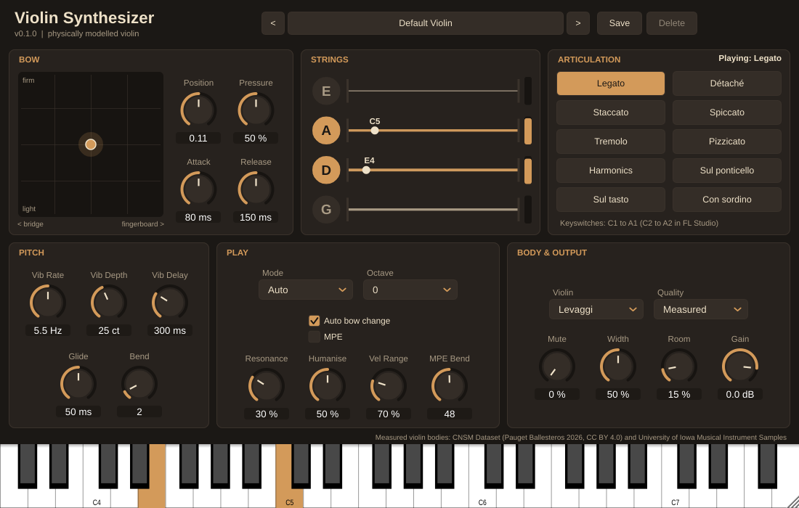

# Octavio

An expressive, physically modelled violin synthesizer plugin (VST3 / AU / Standalone) built with JUCE. Octavio was called Violin Synthesizer before version 1.0. It keeps the same plugin IDs, so delete the old `Violin Synthesizer` plugin when installing Octavio; saved projects should then load with Octavio, and user presets are copied to the new folder the first time it runs.

See [docs/DEVELOPMENT_PLAN.md](docs/DEVELOPMENT_PLAN.md) for the synthesis approach, architecture and milestones.

> **Status: Phases 0–6 implemented.** The plugin models the whole violin: four physically modelled bowed strings (digital waveguides with a bow–string friction model) sharing one bow, measured violin bodies, double stops, legato and string crossings, sympathetic resonance, humanised vibrato, MPE, and ten articulations from staccato to pizzicato. It comes with 32 level-matched factory presets and a resizable editor. It also plays two bowed guitars ([docs/BOWED_GUITAR.md](docs/BOWED_GUITAR.md)). The **electric**, as Jimmy Page played it, has six steel strings under a flat bridge, humbucking pickups and a valve amp. The **acoustic**, as Ramin Djawadi played it, sounds through a measured guitar body. See [docs/PHASES_2_3.md](docs/PHASES_2_3.md), [docs/PHASE4.md](docs/PHASE4.md), [docs/PHASE5.md](docs/PHASE5.md) and [docs/PHASE6.md](docs/PHASE6.md).



---

## Trying the plugin in a DAW

### 1. Get a build

The simplest way is the [latest release](https://github.com/OctahedronV2/Violin-Synthesizer/releases/latest): download `Octavio-VST3-Windows.zip` (or the macOS or Linux zip) under **Assets**.

To try a change before it is released:

Every pull request and push to `main` runs the **Build** workflow on GitHub Actions for Windows. Linux and macOS (universal: Apple silicon and Intel) builds run for version tags, for runs started by hand, and for pull requests labelled `all-platforms`; see [docs/CI.md](docs/CI.md). The repository is public, so this is free.

1. Open the repository's **Actions** tab, then the latest green **Build** run for your branch.
2. Under **Artifacts**, download `Octavio-Windows` (or `Octavio-macOS` or `Octavio-Linux`, when that run built them).
3. Unzip it. Inside are one zip per format (`Octavio-VST3-…zip`, `Octavio-AU-…zip`, `Octavio-Standalone-…zip`). Unzip the ones you need.

You can also build locally for free (see [Building from source](#building-from-source)). On Windows that needs Visual Studio 2022 with the "Desktop development with C++" workload, plus CMake.

### 2. Install it

| Platform | Format | Copy to |
|---|---|---|
| macOS | VST3 | `~/Library/Audio/Plug-Ins/VST3/` |
| macOS | AU | `~/Library/Audio/Plug-Ins/Components/` |
| Windows | VST3 | `C:\Program Files\Common Files\VST3\` |
| Linux | VST3 | `~/.vst3/` |

**macOS only:** the CI builds are ad-hoc signed but not notarised, so Gatekeeper blocks them when downloaded. After copying, run:

```sh
xattr -dr com.apple.quarantine ~/Library/Audio/Plug-Ins/VST3/"Octavio.vst3"
xattr -dr com.apple.quarantine ~/Library/Audio/Plug-Ins/Components/"Octavio.component"
xattr -dr com.apple.quarantine "/path/to/Octavio.app"   # Standalone, if used
```

If Logic or GarageBand does not list the AU straight away, run `killall -9 AudioComponentRegistrar` and restart the host.

### 3. Check that it works

Rescan plugins in your DAW, then create an instrument track with **Octavio** (vendor **OctahedronV2**).

In **FL Studio**:
1. Open **Options → Manage plugins → Find installed plugins**.
2. Add **Octavio** from the Channel Rack.
3. The plugin reports a small latency (from oversampling), which FL Studio compensates automatically.

Things to try:

- **Start from a preset:** click the preset name at the top for 27 factory sounds by category (Solo, Styles, Articulations, Character, Expressive), or step through them with **<** and **>**. **Save** keeps your own versions; they are stored in `Documents/OctahedronV2/Octavio/Presets`.
- **Play expressively:**
  - Velocity sets how hard the bow is drawn.
  - Overlapping notes glide legato; separate notes get a new bow stroke.
  - Chords play as double stops, up to all four strings.
  - Pitch bend works.
  - The mod wheel (CC1) sets bow pressure.
  - The expression pedal (CC11) sets dynamics.
  - CC74 moves the bow between the fingerboard and the bridge.
- **MPE controllers:** turn on **Play → MPE** for per-note bend, pressure (vibrato) and slide (bow position).
- **Articulations:** pick one under **Articulation**, or use keyswitches. MIDI notes 24–33 (C2–A2 in FL Studio's note names) select legato, détaché, staccato, spiccato, tremolo, pizzicato, harmonics, sul ponticello, sul tasto and con sordino. Drag [docs/demo/articulations.mid](docs/demo/articulations.mid) onto the plugin's track to hear them all. Details are in [docs/PHASE5.md](docs/PHASE5.md).
- **Change the violin:** under **Body & Output → Body**, choose one of four measured instruments. **Quality → Light** uses less CPU.
- **Play a bowed guitar:** set **Instrument** to **Electric guitar** or **Acoustic guitar**, or load a preset from the **Bowed Guitar** category. On the electric, **Pickup**, **Drive** and **Drone** replace the body controls. Drone sets how firmly the flat bow catches the neighbouring strings. The acoustic keeps only **Drone**. See [docs/BOWED_GUITAR.md](docs/BOWED_GUITAR.md).
- **Shape the sound:**
  - Drag the **bow pad**: left/right moves the bow between the bridge (bright, glassy) and the fingerboard (soft), and up/down changes its pressure on the string.
  - **Mute** adds a practice-style sordino.
- **Resize the window** from its corner; the whole editor scales.
- **Check save and restore:** save the project, reopen it, and the settings and preset name come back.

The **Standalone** app is the quickest way to hear it without a DAW: open it, pick an audio output under *Options → Audio/MIDI Settings*, and play the on-screen keyboard.

---

## Building from source

### Requirements

- CMake 3.24 or newer
- A C++20 compiler: Xcode 15+ (macOS), Visual Studio 2022 (Windows), GCC 11+ or Clang 14+ (Linux)
- Git and network access at configure time. JUCE 9.0.2 and Catch2 are downloaded automatically.
- Linux only: the JUCE system packages:

  ```sh
  sudo apt install ninja-build libasound2-dev libjack-jackd2-dev ladspa-sdk \
    libfontconfig1-dev libfreetype-dev libx11-dev libxcomposite-dev libxcursor-dev \
    libxext-dev libxinerama-dev libxrandr-dev libxrender-dev libxi-dev \
    libglu1-mesa-dev mesa-common-dev
  ```

### Build

```sh
cmake -S . -B build -DCMAKE_BUILD_TYPE=Release
cmake --build build --config Release --parallel
ctest --test-dir build --build-config Release --output-on-failure
```

The plugins are written to `build/Octavio_artefacts/Release/{VST3,AU,Standalone}`.

Useful options:

| Option | Default | Effect |
|---|---|---|
| `-DVIOLINSYNTH_COPY_PLUGIN_AFTER_BUILD=ON` | `OFF` | Installs the plugins into your user plugin folders after every build |
| `-DVIOLINSYNTH_BUILD_TESTS=OFF` | `ON` | Skips Catch2 and the test executable |
| `-DVIOLINSYNTH_ENABLE_SANITIZERS=ON` | `OFF` | AddressSanitizer + UBSan (GCC/Clang) |
| `-DFETCHCONTENT_SOURCE_DIR_JUCE=/path/to/JUCE` | — | Uses a local JUCE checkout instead of downloading one |
| `-G Xcode` / `-G "Visual Studio 17 2022"` | — | Generates an IDE project |

### Validating

CI runs [pluginval](https://github.com/Tracktion/pluginval) at strictness level 10 on the VST3 on every platform it builds, and `auval -strict` on the AU on macOS. To run it locally:

```sh
pluginval --strictness-level 10 --validate "build/Octavio_artefacts/Release/VST3/Octavio.vst3"
```

### Code style

Formatting follows `.clang-format` (JUCE style) and is checked in CI with clang-format 18:

```sh
git ls-files '*.h' '*.cpp' | xargs clang-format -i
```

`.clang-tidy` holds the static-analysis configuration. Run it with `run-clang-tidy -p build source tests`.

---

## Project layout

```
CMakeLists.txt        plugin target, formats and plugin IDs
cmake/                dependency fetching, warnings, sanitizers
source/dsp/           bowed-string waveguide (friction junction, delays, loss filter), body modes
source/engine/        instruments, voice, oversampling engine, body, guitar amp, output chain
source/plugin/        processor, editor, parameters
resources/bodies/     measured body impulse responses
research/             Python prototype, body estimation, data sources (see research/README.md)
tests/                Catch2 tests, incl. golden data from the Python reference
docs/                 development plan, phase notes, demo MIDI file
.github/workflows/    CI: build, test, pluginval/auval, package
```

## Credits

The measured violin bodies come from the [CNSM Dataset](https://doi.org/10.5281/zenodo.18696786) (Pauget Ballesteros 2026, CC BY 4.0) and the [University of Iowa Musical Instrument Samples](https://theremin.music.uiowa.edu/MIS.html). Details are in [research/data/SOURCES.md](research/data/SOURCES.md).

## Licensing

Octavio is free software: you can redistribute it and/or modify it under the terms of the **GNU Affero General Public License, version 3** (AGPLv3), as published by the Free Software Foundation. See [LICENSE](LICENSE).

It is distributed in the hope that it will be useful, but **without any warranty**; without even the implied warranty of merchantability or fitness for a particular purpose. See the licence for details.

Copyright © 2026 Jake Farr (OctahedronV2).

Third-party components and data:

| Component | Licence | Use |
|---|---|---|
| [JUCE](https://juce.com) | AGPLv3 (this project's choice of JUCE's dual licence) | Plugin framework, fetched at build time |
| Steinberg VST3 SDK (bundled with JUCE) | MIT | VST3 format |
| [PFFFT](https://github.com/marton78/pffft) (Julien Pommier) | FFTPACKv5 licence (BSD-like) | FFT for the measured-body convolution, in [third_party/pffft](third_party/pffft) |
| [Catch2](https://github.com/catchorg/Catch2) | Boost Software License 1.0 | Tests only |
| [CNSM Dataset](https://doi.org/10.5281/zenodo.18696786) (Pauget Ballesteros 2026) | CC BY 4.0 | Measured bodies (Levaggi, Klimke, Stoppani) |
| [University of Iowa Musical Instrument Samples](https://theremin.music.uiowa.edu/MIS.html) | Free to use "for any projects, without restrictions" | Measured body (Tambovsky) |

Details of the data and how it was processed are in [research/data/SOURCES.md](research/data/SOURCES.md).
