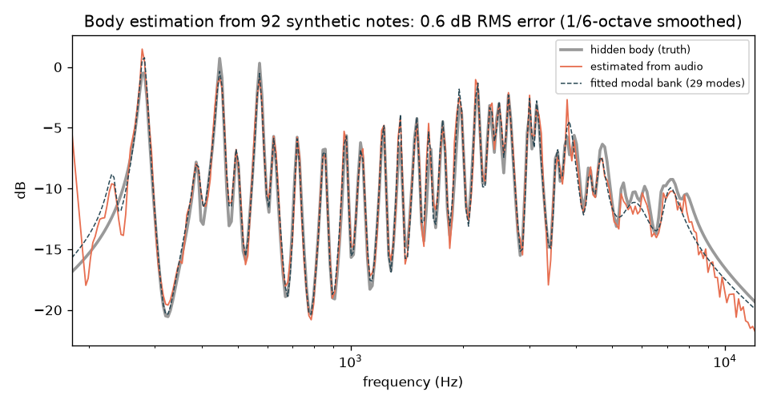
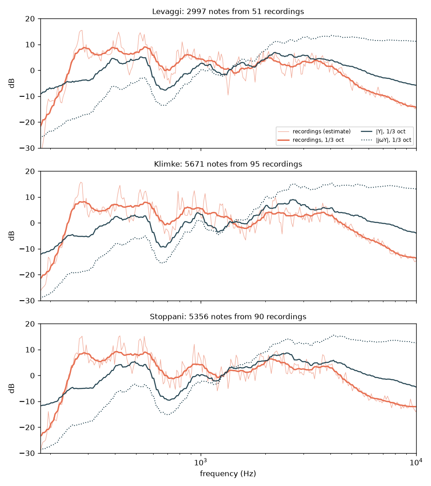
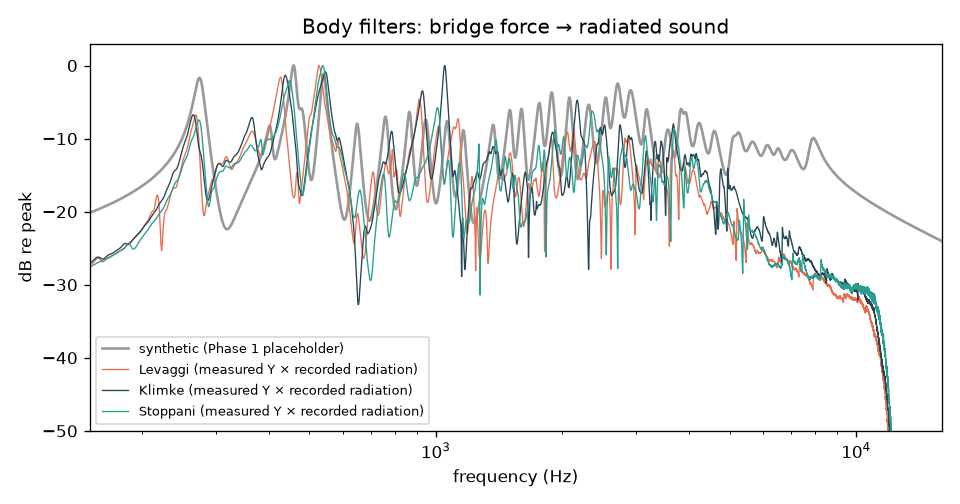

# Violin Body from Open Data

This document covers how the body filter, which maps bridge force to radiated sound, can be made realistic without access to a real instrument. It follows on from [Phase 1](PHASE1_FINDINGS.md), where the body was a synthetic placeholder.

## Summary

- **Measured bodies.** Three real violins are now available as body filters. They are built from the bridge admittance measurements in the open **CNSM dataset** (CC BY 4.0; see [research/data/SOURCES.md](../research/data/SOURCES.md)), which provide the resonances in full detail. The spectral balance comes from **84 minutes of recordings** of scales on the same three violins.
- **Recorded balance.** The recordings show that the radiated balance follows the admittance |Y| much more closely than the common "acceleration" approximation |jωY": about 6 dB RMS difference against about 15 dB at 1/3-octave resolution. Relative to |Y|, the recordings are about 5 dB stronger at 250–700 Hz and about 8 dB weaker at 10 kHz, and they fall steeply below A0. All three violins agree.
- **Extraction pipeline.** A pipeline estimates a body response from *any* recordings of bowed notes: separated notes, as in sample libraries, or continuous scales. On synthetic recordings with a known hidden body, it recovers that body to 0.6 dB RMS (1/6-octave smoothing) and finds the signature modes to within 0.2%.
- **Listening test pending.** Renders of the same performance through the placeholder body and the three measured bodies are in `research/renders/bodies/`.

## 1. Estimating a body from recordings

Module: `research/violin_model/body_estimation.py`. Validation: `scripts/validate_body_estimation.py`.

In Helmholtz motion the bridge force is close to a sawtooth, whose n-th harmonic has amplitude 1/n. Each harmonic of a recorded note is therefore one sample of the body's magnitude response:

```
level(note k, harmonic n) = B(n·f0_k) − 20·log10(n) + g_k      (dB)
```

`g_k` is an unknown per-note level. The steps are:

1. **Segment** the recording into notes, either at silences (`segment_notes`) or at pitch changes in continuous playing (`segment_by_pitch`). Pitch tracking uses YIN with an octave check.
2. **Measure harmonics** frame by frame (`harmonic_observations`). Vibrato sweeps each harmonic across a small frequency range, which fills in the response between notes.
3. **Solve** for B, on a 1/48-octave grid, together with all the g_k (`estimate_body`). This is a sparse least-squares solve with a smoothness penalty and robust reweighting. Observations of the same note in the same fine frequency bin are merged first, which makes long recordings fast.

   Notes that fit badly are then dropped and the solve is repeated. Bad fits come from period doubling, multiple slipping, wrong pitch or noise. A note is an outlier if its misfit is more than 3 robust standard deviations above typical and at least 3 dB. Misfit is the frame-weighted median absolute residual. Without the frame weighting, the light attack and release frames of steady notes outvoted their sustained part, and about half of all good notes were wrongly rejected.
4. **Turn the result into a filter.** Either fit a parametric modal bank (`fit_modes`), or build a minimum-phase FIR (`minimum_phase_fir`).

**Validation.** The test uses 92 synthetic notes from G3 to E7, with random bow position, speed and force, half with vibrato, rendered through a hidden body:

| Measure | Result |
|---|---|
| Estimate vs truth, 1/6-octave smoothed | 0.61 dB RMS (max 1.7 dB) |
| Estimate vs truth, unsmoothed | 1.12 dB RMS |
| Fitted 29-mode bank vs truth | 0.71 dB RMS |
| A0 / B1− / B1+ frequency error | 0.04% / 0.02% / 0.17% |
| Notes rejected | 10 of 92, including the take that fell into period doubling and one in multiple-slip motion |



The main limit is below about 250 Hz, where only the lowest notes' fundamentals give any data.

## 2. The CNSM measured bodies

Module: `research/violin_model/cnsm.py`. Data: `scripts/fetch_cnsm.py`, which downloads 654 MB into `research/external/` (git-ignored).

The dataset has the complex bridge driving-point admittance Y = v/F for three violins (makers Levaggi, Klimke and Stoppani), measured several times in each of two phases up to 25.6 kHz. Measurements of each violin are averaged, and the phase 2 averages are used.

All three show:
- A0 at 267–273 Hz;
- B1− at 428–448 Hz and B1+ at 528–545 Hz;
- a bridge hill around 2–3 kHz.

These match published violin data.

### Radiation balance from the recordings

The admittance says how the bridge moves, not how much sound each frequency radiates. `scripts/radiation_from_cnsm.py` runs the estimation pipeline on every scale recording of each violin. That is 51–95 recordings per violin and about 3,000–5,700 notes, of which only 1–1.3% are rejected. It then compares the result with |Y|:



The smooth ratio R = recorded / |Y|, at 1/3-octave resolution, is the radiation correction. The body filter is Y × R: the measured resonances with the recorded balance. It is band-limited to 150 Hz–10 kHz, because the admittance is mostly measurement noise above about 10 kHz. It is converted to a 0.2 s impulse response at 48 kHz, which holds 99% of its energy within 30 ms.

The correction assumes the recorded string source is an ideal 1/n spectrum. Our string model's bridge force is within ±1 dB of 1/n from 250 Hz to 10 kHz, so applying R to our model does not count any roll-off twice. R also absorbs the room, the microphone, and real players' source roll-off. Those belong in the result, since the goal is to sound like those recordings.



Next to the measured bodies, the Phase 1 placeholder is clearly too bright above 3 kHz and too sparse and peaky in the middle range.

## 3. Next steps

1. **Listening check** of `research/renders/bodies/`.
2. **Plugin body (Phase 3):**
   - Ship the measured impulse responses, `research/data/body_ir_*_48k.wav`, via `juce::dsp::Convolution` as the high-quality body.
   - Offer a fitted modal bank as the low-CPU option.
   - Credit the CNSM dataset in the About screen.
3. **Iowa MIS cross-check:** run `scripts/estimate_body_from_recordings.py` on the anechoic Iowa violin samples. This gives a room-free radiation balance to compare with the CNSM recordings.
4. **Overpressure reference:** the recordings could provide real examples of heavy bowing, to compare with the model's noise-like overpressure behaviour (see Phase 1 findings, §3.1).
