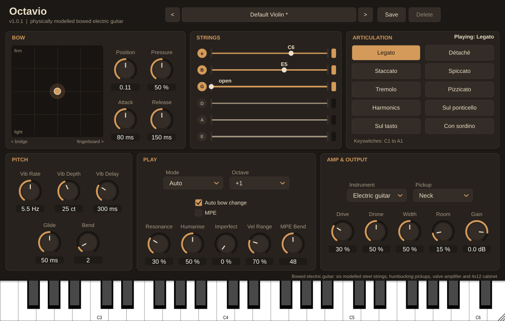
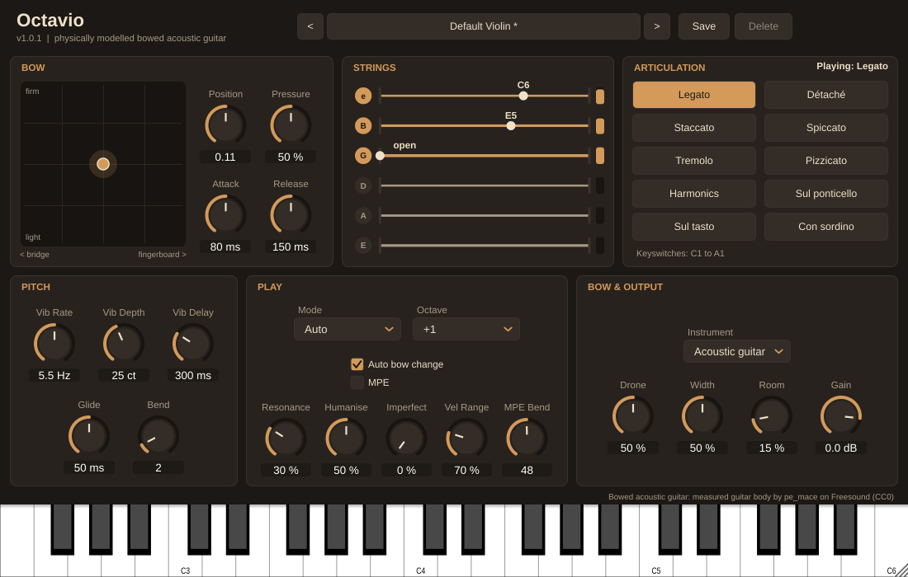

# Bowed guitar

A user tester asked for a bowed guitar. Octavio now has an **Instrument** setting with three choices, all played with a violin bow:

- **Violin**: the default, unchanged.
- **Electric guitar**: played the way Jimmy Page did in the late sixties. The violin's strings, bow and player are modelled as before, but a pickup and an amplifier take the place of the violin's body.
- **Acoustic guitar**: a steel-string acoustic, as Ramin Djawadi bowed a Yamaha acoustic in his scores. It is heard through a measured guitar body; see [The bowed acoustic guitar](#the-bowed-acoustic-guitar).



## Where it lives, and why

| Option | For | Against |
| --- | --- | --- |
| **An instrument inside Octavio** (chosen) | One download; every Octavio control, articulation and preset habit works on it at once; it is the first real use of the `InstrumentSpec` that Octastra needs (phase O0 in [OCTASTRA_DESIGN.md](OCTASTRA_DESIGN.md)) | Octavio is no longer only a violin |
| A separate plugin | Clean product story | A new target, IDs, CI and release for one instrument |
| A section in Octastra | Shares the orchestra engine | A bowed electric guitar is not an orchestral string section, and Octastra is not built yet |

Octavio stays the solo bowed-string plugin. The guitar is a string-count, tuning and output-stage change on the same engine, so the work needed for it is exactly the generalisation Octastra's viola, cello and bass need: the strings, their range and their pickup or body now come from an `InstrumentSpec` (`source/engine/StringData.h`), and the voices, string allocator and editor read the number of strings from it.

## The model

| Part | Violin | Bowed guitar |
| --- | --- | --- |
| Strings | 4, G D A E, 328 mm | 6, E A D G B E (MIDI 40–64), 628 mm (Les Paul scale), light 10–46 steel set |
| String impedance | from typical tensions | Z = T / (2 L f0) from published tensions: 0.73 kg/s (low E) to 0.17 kg/s (top E) |
| Losses while bowed | T60 1.5 s, 0.25 s at 4 kHz | T60 6 s, 1.2 s at 4 kHz: steel on a solid body rings on |
| Range | G3–G7 | E2 (open low E) to D6 (22nd fret) |
| Pitch | fretless: slurs glide, vibrato either side of the note | fretted: slurs step from fret to fret, vibrato bends up from the note, as a guitarist's does |
| Bridge | arched: the bow reaches one or two strings | flat: the bow lies across every string between the lowest and highest played ones, and one more on each side (the **Drone** control) |
| Output | bridge force → measured body | string velocity under the pickup coils → pickup resonance → valve preamp → 4x12 cabinet |

### Pickup

A magnetic pickup's voltage follows the string's velocity where it sits. `BowedString` reads that velocity from its two travelling waves: the wave on its way from the bow to the end of the string, minus the one reflected back (`BowedString::process`). Each pickup is a humbucker with two coils 18 mm apart, centred 41 mm (bridge) and 156 mm (neck) from the bridge; **Both** averages all four coils. Because the pickups sit at fixed distances, each note has its own comb of missing harmonics, which is much of why a neck and bridge pickup sound so different. The coil's inductance against the cable's capacitance adds a resonance: 3.2 kHz (neck), 2.8 kHz (bridge), 4.3 kHz (both, lightly damped).

### Amplifier

`GuitarAmp` replaces the body. The preamp runs at the internal rate (four times 48 kHz), before the decimator, so its distortion does not alias. **Drive** adds up to 40 dB of gain into an asymmetric soft clipper (even harmonics, as a single valve stage gives) and thins the lows more as it rises so low strings stay tight. The output is level-compensated, so Drive changes the tone, not the loudness. The cabinet is a closed 4x12: a 110 Hz speaker resonance, a scooped low-mid, a presence peak at 2 kHz and the cone's roll-off above 5 kHz. The width, room, gain and limiter after it are the violin's.

The guitar has no sympathetic-resonance model; the drones take that role.

## Getting the steel strings to speak

The violin's force windows did not carry over. Bowed at the violin's pressures, the steel strings mostly slipped three or four times per period: a steady but thin, whistling tone instead of the sawtooth (Helmholtz) motion. They need more bow weight, the heavy strings most, but press too hard and they scratch. Each string's window now starts where it settles into Helmholtz motion and ends before scratch rises (`ViolinSynthTests "[.guitarstrings]"`):

| String | Window (fraction of F_max) | Helmholtz / scratchy notes at the window's middle |
| --- | --- | --- |
| E | 0.50–0.65 | 100% / 4 of 10 |
| A | 0.45–0.65 | 100% / 1 of 10 |
| D | 0.45–0.65 | 89% / 0 of 10 |
| G | 0.35–0.60 | 98% / 0 of 10 |
| B | 0.30–0.55 | 84% / 1 of 10 |
| E (top) | 0.20–0.50 | 90% / 1 of 10 |

The guitar also plays further from the bridge: Bow Position is scaled by 1.45, so the default 0.11 bows at 0.16 of the string, between the pickups, where the steel strings speak most cleanly and where a bowed Les Paul is usually played.

Two things this turned up, both worth knowing for the violin:

- **The player listened at the wrong pitch.** The twisting string sounds 1.4 cents sharp of the note (`torsionTuning`), but the clean-bowing player compared each period with one period of the *note* earlier. On the violin, whose energy sits in low harmonics, that barely matters; on the bright guitar it read as scratch, so the player eased off into multiple slipping. The guitar's player now listens at the sounding pitch (`InstrumentSpec::playerHearsTwist`). The violin keeps its old behaviour so it renders exactly as before; switching it over is a candidate follow-up, to be measured with `[.bownoisereport]`.
- **The scratch meter has the same bias.** `[.guitarscratch]` predicts at the sounding pitch; the violin's meter in `BowNoiseTests.cpp` does not.

At default settings (`[.guitarscratch]`, 28 notes from E2 to E5 at two velocities):

| | Helmholtz | Scratchy notes | Steady scratch |
| --- | --- | --- | --- |
| Violin, pressure 50% | 97% | 1 of 16 | −34.8 dB |
| Bowed guitar, pressure 50% | 92% | 5 of 28 | −35.9 dB |

The low E string is the weak spot: its notes settle cleanly but four in ten have a scratchy moment. The drones, bowed at 0.8–1.0 of the played strings' weight, reach Helmholtz motion about half the time at the default Drone setting and 92% at full Drone (`[.guitardrones]`); lighter, they whistle, which is part of the sound of a bow lying across several strings.

## Controls

| Control | Where | What it does |
| --- | --- | --- |
| Instrument | Body & Output (Amp & Output, Bow & Output) | Violin, Electric guitar or Acoustic guitar. Changing it silences the strings. |
| Pickup | Amp & Output | Neck (round, full), Both (bright, hollow) or Bridge (thin, cutting) |
| Drive | Amp & Output | Clean amp at 0, heavily overdriven at 100% |
| Drone | Amp & Output, Bow & Output | 0: the bow is tilted onto the played strings only. Above 0: the flat bow also sounds the open strings it lies on, more firmly as it rises. |

All four are automatable. The guitar reuses every other control: Bow Position and Pressure, articulations and keyswitches (pizzicato becomes a fingerpicked electric guitar), vibrato, glide (which only affects bends now: frets step), room and width. When the guitar is selected, the body controls and Mute make way for the amp controls.

Three presets are in a new **Bowed Guitar** category: **Bowed Guitar** (neck pickup, warm amp), **Heavy Bowed Guitar** (bridge pickup, 80% drive, slow swells, big room) and **Bowed Drone Wash** (both pickups, full drones, every note its own string). They are level-matched with the violin presets.

## The bowed acoustic guitar

Jake asked for the sound Ramin Djawadi got from a bowed guitar. Interviews describe it as a Yamaha steel-string acoustic played with a violin bow. The acoustic shares the electric's flat bridge, frets, drones and player. These things differ:

| Part | Electric | Acoustic |
| --- | --- | --- |
| Strings | light 10–46 steel, 628 mm | light 12–53 phosphor bronze, 650 mm (a Yamaha dreadnought): Z from 0.95 kg/s (low E) to 0.24 kg/s |
| Force windows | 0.20–0.65 F_max | 0.38–0.75 F_max: the heavier strings need more weight before they settle into Helmholtz motion |
| Losses while bowed | T60 6 s, 1.2 s at 4 kHz | T60 3 s, 0.15 s at 2 kHz: the bridge sits on a thin top that soaks up the strings' high frequencies, and they die much faster than on a solid body |
| Bow position | 0.16 of the string at the default Bow Position (× 1.45) | 0.19 (× 1.7): the top is in the bow's way near the bridge, so an acoustic is bowed nearer the soundhole |
| Output | pickup → amp → cabinet | bridge force → measured guitar body, as the violin's bridge force goes through its body |
| Range | E2–D6 (22 frets) | E2–C6 (20 frets) |



**The body** is a measured filter from a Godin guitar's under-saddle piezo pickup to a microphone in front of it ("Sweep guitare_dc" by pe_mace, Freesound 696487, CC0). The piezo reads the force the strings put on the saddle, so this is the same bridge force → sound transfer as the violin bodies. It shows a guitar's air resonance at 98 Hz and top resonances at 190 and 246 Hz. `research/scripts/export_guitar_body.py` trims it to the violin bodies' 200 ms and writes `resources/bodies/acoustic-guitar.wav`. It is convolved like the violin bodies, whatever the Quality setting; it has no modal version.

**Matching a recording.** The acoustic's tone was fitted to a recording of an acoustic guitar played with a bow ("Guitar_bow_playing_stereo" by leonseptavaux, Freesound 346484, CC BY). The recording is not shipped. It plays E3–G#4, the same register as the demo. The comparison is the long-term spectrum in octave bands. With the electric's string losses and bow position, the acoustic's spectrum was 12.1 dB (RMS, 250 Hz–8 kHz) off the recording, far too bright. Damping from 2 kHz (0.15 s), with the bow at × 1.7, brought the misfit to 2.2 dB. That matches how a guitar top absorbs a string's upper harmonics:

| Octave band (Hz) | 250 | 500 | 1k | 2k | 4k | 8k |
| --- | --- | --- | --- | --- | --- | --- |
| Recording | 0 | −4.7 | −10.3 | −15.2 | −22.6 | −34.8 |
| First model | −1.4 | −4.9 | −0.2 | 0 | −7.6 | −16.9 |
| Final model | 0 | −6.6 | −11.0 | −16.8 | −23.9 | −30.4 |

At default settings the acoustic settles into Helmholtz motion 96% of the time, and 3 of 28 notes have a scratchy moment (`[.guitarscratch]`). The electric has 5 of 28.

Two presets: **Bowed Acoustic** (light drones, a small room) and **Cinematic Bowed Acoustic** (slow swells, more drone, a big hall).

## Listening

`/mnt/project-files/showcase/bowed-guitar/` in the project has a 44-second piece in E minor (`bowed-guitar-demo.mid`, written by `make_guitar_demo.py`) rendered through each electric preset and through Bowed Acoustic. There is also the Bowed Guitar preset with Drone at 0, to hear what the flat bow adds, and a 30-second lament in D minor (`bowed-acoustic-lament.mid`, written by `make_acoustic_demo.py`) through both acoustic presets. Render your own with:

```
RENDER_MIDI=piece.mid RENDER_OUT=out.wav RENDER_PRESET="Heavy Bowed Guitar" RENDER_PARAMS="octave=2" \
  ViolinSynthTests "[.rendermidi]"
```

## Tests

- `[guitar]`: on both guitars, every string plays in tune (open and fretted, within 6 cents) and the range is right. Also: the flat bow's drones follow the played strings, switching instrument works, the pickup and drive levels match, and Pickup and Drive leave the acoustic untouched.
- `[allocator]`: notes and an E minor shape spread over six strings.
- The violin's golden sound check, level-matched presets and every other test pass unchanged: the violin renders exactly as before.
- Diagnostics: `[.guitarlevels]`, `[.guitarscratch]`, `[.guitarstrings]`, `[.guitardrones]`, `[.rendermidi]`.

## Not done yet

- A tape echo (Page used an Echoplex); Room stands in for it for now.
- A wah and a fuzz pedal.
- Palm muting and a tremolo arm.
- Measured data for the electric: there is no body to measure, but the pickup and amp are textbook values, not fitted to recordings of a bowed Les Paul.
- The acoustic's body is a Godin, not a Yamaha. A tap or sweep measurement of a Yamaha dreadnought's bridge would be closer to Djawadi's instrument.
