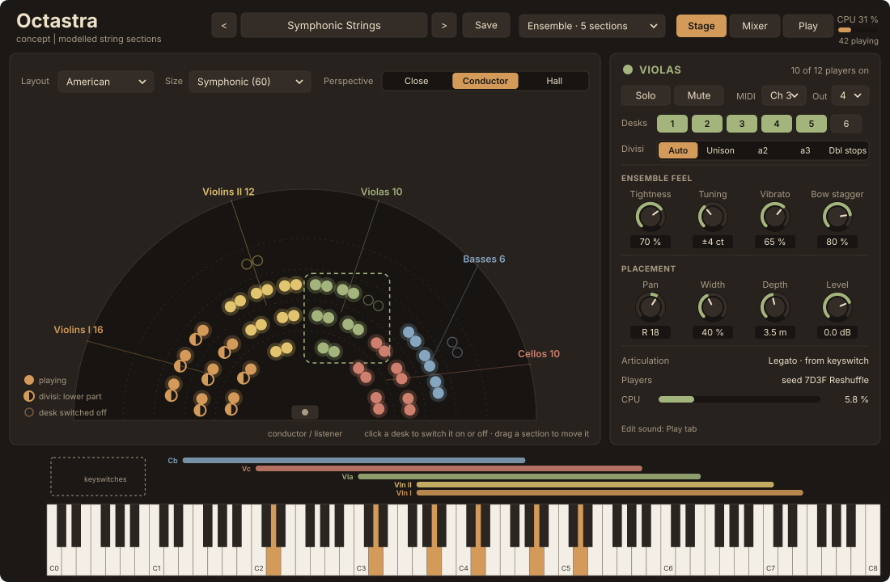
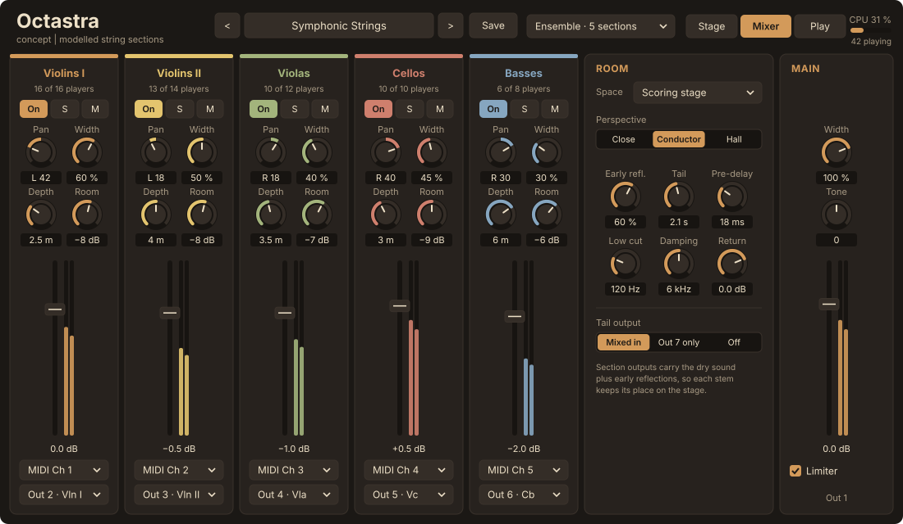
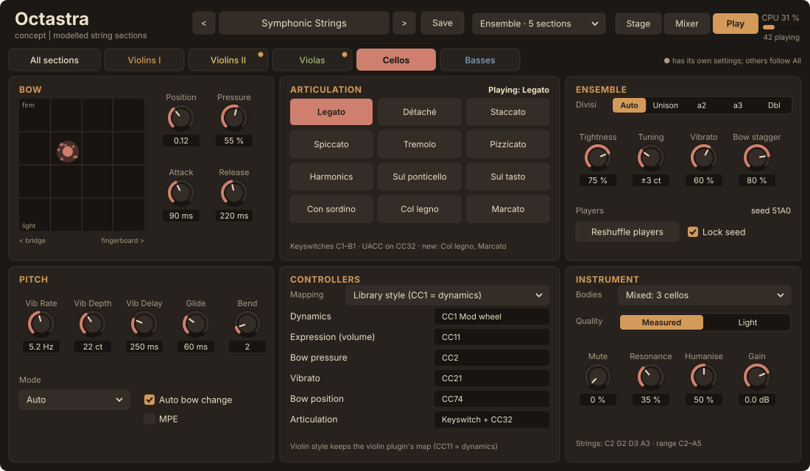
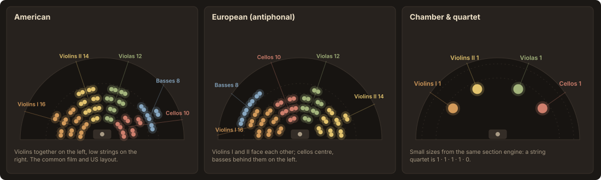
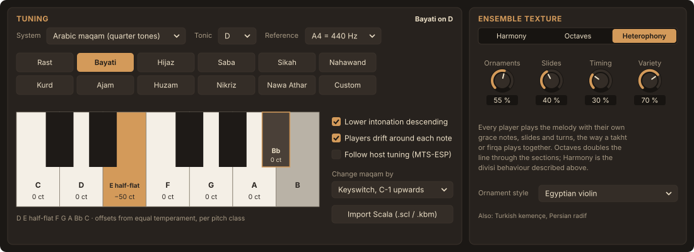
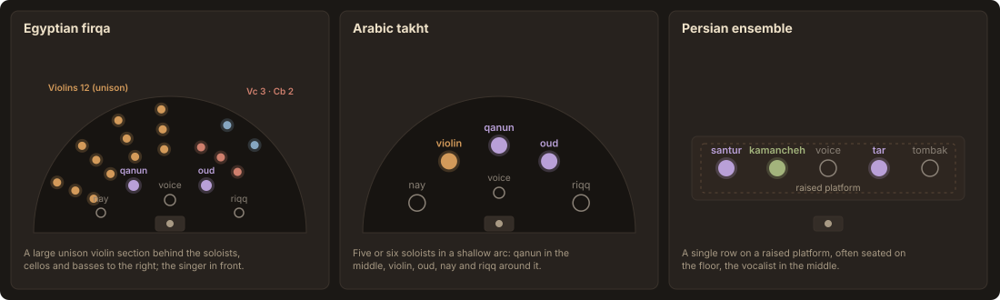

# Octastra: a string orchestra built on the violin engine

> This is the design draft from 27 September 2026, kept for reference. It was written as an HTML page with inline mock-ups; the mock-ups are the SVG files in `docs/octastra/`.

Five sections of individually modelled players (Violins I, Violins II, Violas, Cellos, Basses), each seated somewhere on a virtual stage, switchable desk by desk, and usable either as one instance per section or as a whole orchestra in one instance. Maqam tuning, heterophony and Middle Eastern ensembles are part of the design from the start.

Drafted 27 September 2026 from the Violin Synthesizer repository at Phase 6; Middle Eastern music and body data added the same day. Design only.

## Summary

Jake's starting idea holds up. Orchestral string libraries are organised around the five sections, their sizes and where they sit, and a physical model can go one step further than recorded libraries: every chair can be a separate player with its own tuning, timing, vibrato and bow, placed at its own position. The recommendation is one plugin that does both jobs DAW users need:

- **One plugin, two scopes.** Load it as a single section (one track per section, the way most composers build templates) or as the full ensemble (quick sketching from one keyboard, or five MIDI channels into one instance).
- **Orchestra → section → desk → player.** Desks (pairs of players sharing a stand) are the unit you switch on and off, as in a real orchestra. Section sizes follow the standard 16 · 14 · 12 · 10 · 8.
- **Stage view first.** A top-down seating chart is the main screen: click desks, drag sections, pick American or European seating, and choose a listening perspective instead of microphone positions.
- **Share the expensive parts.** Each player runs its own strings and bow. Bodies, rooms and oversampling filters are shared per section, which keeps a 60-player orchestra within reach of a normal computer.

## How orchestral string libraries are usually organised

These conventions come from the sample libraries composers already use (Spitfire, Cinesamples, Orchestral Tools, VSL, Audio Modeling's SWAM). Following them means the plugin fits into existing templates and MIDI habits on day one.

| Convention | What libraries do | What this plugin does |
| --- | --- | --- |
| Five sections | Violins I, Violins II, Violas, Cellos, Basses as separate patches, plus an "ensemble" patch spread across the keyboard for sketching. | Same five sections. Ensemble scope replaces the sketch patch, with real voice leading instead of a fixed split. |
| Section size | Fixed by the recording: symphonic around 16 · 14 · 12 · 10 · 8, chamber 4 · 3 · 3 · 3 · 3 or similar. Sometimes a separate "divisi" or "a2" patch. | Any size from a quartet to 16 · 14 · 12 · 10 · 8, set per section, and individual desks can be switched off. |
| Seating | Baked into the recording: most use American seating, a few offer antiphonal violins. | Seating is computed, so the layout can change: American, European, chamber, or custom. |
| Mic positions | Close, Decca tree, ambient and outrigger mics mixed by the user. | A single Perspective control (Close, Conductor, Hall) plus a room section. Same job, fewer knobs. |
| Articulations | Keyswitches, UACC (CC32 values), or one articulation per MIDI channel, driven from DAW expression maps. | Keyswitches below each section's range, UACC on CC32, and the Articulation parameter is automatable. |
| Dynamics | CC1 (mod wheel) crossfades dynamics; CC11 is expression (volume). | A "Library style" controller map does the same, so MIDI written for sample libraries plays correctly. The violin plugin's map (CC11 = dynamics, CC1 = pressure) stays as an option. |
| Outputs | One stereo output per patch; multi-output for ensemble patches. | Main stereo out plus one stereo out per section and an optional room tail out. |

## How people will use it in a DAW

Three workflows cover nearly everyone. The plugin should support all three without separate products, which is why the scope switch sits in the header.

*Template is how most media composers work: every section on its own track, with its own CC lanes and articulation map, and the DAW spreads the instances across CPU cores. Multitimbral saves instances. Sketch turns chords from one keyboard into an orchestral voicing.*

**Recommendation:** make the template workflow the reference case and design Ensemble scope around it. A Section-scope instance is the same plugin with the other four sections hidden, so a user can start in Sketch, then save five Section-scope copies of the same preset when the piece needs detailed MIDI. Every instance keeps the same seating, so stems from separate instances still sit correctly on the stage.

## Structure: orchestra, section, desk, player

Each level owns a small, clear set of controls, so nothing needs to be set 60 times.

| Level | What it owns | Where you edit it |
| --- | --- | --- |
| **Orchestra** | Seating layout, section sizes, perspective, room, main output, controller map, CPU quality. | Stage header, Mixer → Room and Main |
| **Section** | Everything the violin plugin has today (bow, vibrato, articulation, body, mute), plus divisi mode, ensemble feel (tightness, tuning spread, vibrato spread, bow stagger), pan, width, depth, level, MIDI channel, output. | Stage inspector, Mixer strip, Play tab |
| **Desk** | On or off. Outside and inside player for divisi, as orchestras divide by stand. | Click on the stage or the desk buttons |
| **Player** | A generated personality: tuning offset, onset delay, vibrato rate and depth, bow speed and pressure habits, bow length used, which body. Created from a seed, never edited one by one. | Reshuffle or lock the seed |

Section settings can follow **All sections** or be set per section, as shown in the Play view below. The default is that bow, vibrato and articulation follow All, while placement and ensemble feel are per section.

## Stage view (the main screen)

- **Seating chart.** Every dot is a player, seen from above with the conductor at the bottom. Players light up as they play; half-filled dots are playing the lower divisi part. Click a desk to switch it off, drag a section to move it, and the pan, delay and distance follow.
- **Layout, Size, Perspective.** The three decisions that change the whole sound, kept together at the top. Size presets: Quartet, Chamber (8 · 6 · 4 · 4 · 2), Studio (12 · 10 · 8 · 8 · 6), Symphonic (16 · 14 · 12 · 10 · 8).
- **Inspector.** Shows the selected section: solo and mute, MIDI channel and output, desks, divisi, ensemble feel and placement. CPU per section is shown so the cost of a size change is visible.
- **Range strip.** Each section's playable range above the keyboard, and the keyswitch zone. In Section scope only that section's bar and keyswitches appear.
- **Header.** Scope switch (Ensemble, or one section), the three tabs, presets, total CPU and the number of players sounding.
- **Same look as the violin.** Palette, knobs and scaling rules are the ones from `LookAndFeel.h`, at the same 1100 × 700 base size.

## Mixer view

- **One strip per section.** Pan, width and depth here are the same values as on the stage, shown as a mixer for people who prefer faders to a seating chart.
- **Depth** is distance from the listener in metres. It sets level, a gentle high-frequency roll-off from air, arrival time, and how much early reflection the section gets.
- **Room.** One shared space with early reflections and a tail. The tail can go to its own output so a user can replace it with their favourite reverb.
- **Outputs.** Section outputs carry the dry section plus its early reflections, so a stem on its own still sounds placed.

## Play view

- **It is the violin editor, per section.** Bow pad, articulations, pitch and body carry over. The small cloud around the bow-pad dot shows how far players spread from the section setting.
- **Section tabs.** "All sections" edits everything at once; a dot marks sections with their own settings. This keeps five sections manageable.
- **Ensemble panel.** Divisi mode, tightness (onset spread), tuning spread, vibrato spread and bow stagger, plus the player seed.
- **Controllers.** The controller map is chosen in one place, with Library style as the default for this plugin.

## Seating and space

Each seat has an angle and a distance from the listener. From those the plugin derives, per player:

- **Pan** from the angle, using a constant-power law, narrowed by the section's Width.
- **Arrival delay** from the distance, at the speed of sound. A player 8 m away arrives about 22 ms after one at 0.5 m. These small differences are a large part of why a real section sounds wide and soft-edged instead of like one violin copied 16 times.
- **Level and air**: level falls with distance (clamped so the back desks are softer, not inaudible) and a shelf trims high frequencies slightly for far seats.
- **Early reflections** per section, from the section's position on the stage, then a shared tail.

**Perspective** moves the listener: Close sits just in front of the sections (drier, wider, more bow detail), Conductor is the podium, and Hall is a seat in the stalls (narrower, more room). It is one control because users rarely want to mix five virtual microphones.

Mono compatibility needs a test: per-player delays can comb-filter when summed to mono. The delays are spread and randomised per player, and a mono fold-down check belongs in the test suite.

## Players and divisi

### What makes each player different

| Trait | Range per player | Controlled by |
| --- | --- | --- |
| Tuning offset and slow drift | ±1 to ±8 cents | Tuning spread |
| Onset delay | 0 to 40 ms, much less for short notes | Tightness |
| Vibrato rate, depth and phase | ±10 % rate, ±30 % depth | Vibrato spread (extends today's Humanise) |
| Bow speed, pressure and position habits | small offsets around the section setting | Humanise |
| Bow used per stroke | varies, so bow changes land at different times | Bow stagger |
| Body | one of the section's measured bodies plus a small per-player tone offset | Bodies setting |

The personalities come from a seed saved with the project, so a bounce always sounds like playback and like the last bounce. **Reshuffle** picks a new seed.

Bow stagger deserves a note. The violin engine already changes bow automatically when the bow runs out (`Violin::bowLengthMetres`), preferably on a note change. Real sections stagger their bow changes on long notes so the section never breaks at once. Giving each player a slightly different bow speed and bow length does this naturally.

### Divisi: what happens when a section plays a chord

A recorded library needs a separate divisi patch. Here the section just splits its players, the way an orchestra does.

| Mode | Behaviour |
| --- | --- |
| **Auto** (default) | One note: everyone plays it. Two notes: outside players take the upper note, inside players the lower. Three or more: split by desk, top note to the front desks. Beyond the number of desks, players fall back to double stops. |
| **Unison** | Everyone plays the top note only. Useful for lines played from chords. |
| **a2 / a3** | Always split into two or three parts, even if fewer notes are held; spare parts double the nearest note. |
| **Double stops** | Every player plays the whole chord across their strings, as the violin plugin does today (up to four notes). |

Legato still works per player: when a new note overlaps, each player slurs to their part of the new chord, so voice leading inside a divisi section is kept.

## The instruments

The violin engine already models a four-string bowed instrument from data: string tunings, impedances and bow-force windows live in `source/engine/StringData.h`, and the body is a measured impulse response. Viola, cello and bass are new data, and the body-estimation pipeline in `research/violin_model/body_estimation.py` was built to work on any recordings of bowed notes.

| Instrument | Open strings (MIDI) | String length | Range (sounding) | Keyswitches | Body data |
| --- | --- | --- | --- | --- | --- |
| Violin | G3 55 · D4 62 · A4 69 · E5 76 | 328 mm | G3–E7 | C1–B1 | 4 measured bodies today (CNSM, Iowa) |
| Viola | C3 48 · G3 55 · D4 62 · A4 69 | ≈ 370 mm | C3–E6 | C1–B1 | Estimate from Iowa MIS viola recordings |
| Cello | C2 36 · G2 43 · D3 50 · A3 57 | ≈ 690 mm | C2–A5 | C1–B1 | Estimate from Iowa MIS cello recordings |
| Double bass | E1 28 · A1 33 · D2 38 · G2 43 (fourths; optional low C extension to C1 24) | ≈ 1050 mm | E1–G4 | C0–B0 | Estimate from Iowa MIS double bass recordings |

> **Keyswitch clash found in the code.** Keyswitches start at MIDI 24 for every instrument (`firstKeyswitch = 24` in `source/engine/Articulation.h`). That is fine for violin, viola and cello, but the bass's open E string is MIDI 28, so bass notes would switch articulations. Keyswitches need a per-section base: C0 for basses and for Ensemble scope, C1 elsewhere.

MIDI notes are sounding pitch for every section, including the bass (which is written an octave higher), because that is what sample libraries and DAW notation views expect.

**Body data is the main sourcing risk.** The CNSM dataset only covers violins, so the lower instruments start with one measured body each. Variety between players then comes from a small per-player tone offset (a few percent shift of the main body modes). More recordings can be added later through the same pipeline.

**A possible CPU win to research first:** the string runs at 176.4 kHz or more because slower rates snapped stick-slip timing to the sample grid and detuned the violin's top octave (`docs/PHASE1_FINDINGS.md`). Cello and bass notes have much longer periods, so they may stay in tune at half that rate, which would halve their cost.

## Engine

*One section. Everything left of the body buses runs once per player at the oversampled rate; everything right of them runs once per section at the host rate.*

### The trick that makes 60 players affordable

In the violin plugin the body filter is a convolution, and it is expensive. Running one per player would cost more than the strings. But the body is a linear filter, and pan gains and seat delays are linear too, so they can be moved in front of it. Each player's bridge force is delayed, panned into left and right, and added to one of two or three body buses per section. Each bus is convolved once per channel. The result is the same as one body per player, at a fixed cost however many players there are. Decimation from the oversampled rate is also done per bus rather than per player.

### What changes in the code

| Today | Change |
| --- | --- |
| `StringData.h`: one fixed array of four violin strings, 328 mm | An `InstrumentSpec` per instrument: strings, length, impedances, force windows, bow length, range, keyswitch base, bodies |
| `Violin` class, `bowLengthMetres = 2.0` | Becomes `BowedInstrument`, built from a spec; one per player |
| `Body`: four violin bodies, one per engine | Body sets per instrument; body buses per section |
| `ViolinEngine`: one violin, its own oversampling and output chain | A `Section` (players, divisi allocator, buses) and an `Orchestra` (sections, room, outputs) |
| `OutputChain`: width and room per instance | Width per section; room moves to the orchestra |
| `Articulation.h`: keyswitches from note 24 | Keyswitch base per section |

The engine becomes a shared library inside the same repository, with two plugin targets: Violin Synthesizer, which must sound identical after the refactor (the existing golden tests check this), and Octastra. Improvements to the strings then reach both.

## CPU budget

The one measured number is the violin engine playing one note at 48 kHz: **2.6–2.9 % of one core**, most of it in the string at 192 kHz (`docs/PHASES_2_3.md`). Everything else below is an estimate to be replaced by profiling early in the section work.

| Configuration | Players | Estimated CPU, all playing | Notes |
| --- | --- | --- | --- |
| String quartet | 4 | ≈ 10 % | Close to four violin plugins |
| Chamber, 8 · 6 · 4 · 4 · 2 | 24 | ≈ 50 % | Shared bodies, no other optimisation |
| Symphonic, 16 · 14 · 12 · 10 · 8 | 60 | ≈ 120 % | Over one core in a single instance; fine as five instances |
| Symphonic, after optimisation | 60 | ≈ 30–50 % | Players of a section processed in SIMD lanes, lower rate for cello and bass |

Idle strings are already skipped after a second of silence (`StringVoice.cpp`), and a player uses one string for most notes, so the cost follows the number of notes sounding, not the number of strings. Switched-off desks cost nothing.

Two design consequences follow. First, the template workflow is also the fast one, because DAWs run separate instances on separate cores; Ensemble scope should process its sections on worker threads for the same reason. Second, a **Quality** setting should offer a fallback if the full model is too heavy: *Full* models every seat, *Balanced* models up to eight players per section and fills the other seats with lighter copies of them (shifted in time, pitch and seat), and *Eco* models four. Whether the copies sound convincing is a listening question to settle before committing to it.

## MIDI, automation and presets

### MIDI routing in Ensemble scope

- **By channel** (default): channels 1–5 go to Violins I through Basses; channel 16 plays everyone.
- **Auto-voice** (Sketch): one keyboard. The lowest note goes to the basses, the top note to Violins I, and the notes between are shared downwards through Violins II, Violas and Cellos. Missing parts double (Violins I and II in unison, cellos doubling the bass an octave up). Notes outside a section's range pass to the next section.
- **Split**: fixed key zones per section, for people who want predictable ranges.

### Controller maps

| Control | Library style (default here) | Violin style (the violin plugin's map) |
| --- | --- | --- |
| Dynamics (bow speed) | CC1 | CC11 / CC2 |
| Expression (volume) | CC11 | n/a |
| Bow pressure | CC2 | CC1 |
| Vibrato | CC21 | Aftertouch |
| Bow position | CC74 | CC74 |
| Articulation | Keyswitch or CC32 (UACC) | Keyswitch |

### Automation and outputs

- About 30 parameters per section and 25 for the orchestra, about 175 in all, with stable IDs prefixed by section (`vla.bowPressure`). Every instance exposes all of them in the same order, whatever its scope, so automation survives a scope change.
- Outputs: main stereo (always), one stereo bus per section, and an optional room tail bus. By default everything also goes to the main output, so a user who never opens their DAW's multi-output routing still hears everything.
- Latency is the same for every scope and every instance, so five Section-scope instances stay aligned.

### Presets in two layers

The violin plugin's presets set everything. Here that would mean changing the hall also changes the vibrato. Presets split into **Ensemble** presets (layout, sizes, placement, room) and **Playing** presets (bow, vibrato, articulation, ensemble feel, per section or for all). The preset bar loads both together by default, with a lock on either layer. Suggested factory sets: Symphonic, Film Wide, Chamber Orchestra, String Quartet, Baroque Ensemble, Intimate Close, and playing styles such as Lush Legato, Tight Spiccato, Tremolo Swell and Pizzicato.

## Middle Eastern music

This is a better fit for a physical model than for a sample library. Maqam, makam and dastgah music lives on intervals between the piano keys, on slides and on ornaments, and every player in an ensemble decorates the same melody slightly differently. A fretless modelled string plays any pitch continuously, and Octastra already gives every player their own personality. Three things make it work: tuning, texture and seating, plus new instruments over time.

### Maqam tuning, built into the core

Tuning belongs in the first version, not an add-on, because it changes one engine interface early. Today every note becomes a frequency through `midiToHz` in `StringData.h`, which is plain equal temperament. A tuning table goes in front of it. The string allocator already accepts fractional notes (`stringForNote(double midiNote)`), so the rest of the engine needs no change.

| System | How intervals are described | What Octastra offers |
| --- | --- | --- |
| Arabic maqam | Notated with quarter tones (E half-flat, B half-flat). In practice the neutral notes shift with the maqam: E half-flat sits a little higher in Sikah than in Bayati. | Presets per maqam (Rast, Bayati, Hijaz, Saba, Sikah, Nahawand, Kurd, Ajam, Huzam, Nikriz and more) with cents per pitch class, a tonic, and optional different intonation when descending |
| Turkish makam | The Arel-Ezgi-Uzdilek theory divides the whole tone into 9 commas (53 per octave), with accidentals of 1, 4, 5 and 8 commas. | A 53-comma system with the common makams (Rast, Uşşak, Hicaz, Hüseyni, Saba, Segâh and more) |
| Persian dastgah | Koron (lowered) and sori (raised) notes, by amounts that vary with the dastgah and the player, often near a quarter tone. | Dastgah presets (Shur, Homayun, Segah, Chahargah, Mahur and more) with adjustable koron and sori depth |
| Anything else | Scala files, or a tuning shared by the host | Scala (.scl and .kbm) import, and MTS-ESP support so several plugins retune together (its licence needs checking against the AGPL) |

The maqam can change mid-piece by keyswitch, CC or program change, because modulation between maqamat is part of the music. MPE controllers such as a Seaboard or LinnStrument already work for free per-note pitch.

*A Tuning panel (in the Play tab, shared by all sections by default) and an Ensemble texture panel. Bayati on D shown: E half-flat 50 cents below E, the other notes as on the piano.*

### Heterophony: a third way for a section to play

Western section writing splits chords across players (divisi). Arabic, Turkish and Persian ensembles usually play one melody together, each player adding their own grace notes, slides, trills and turns. Egyptian orchestras also double the melody in octaves through the low strings. So the section gets a texture setting:

- **Harmony**: the divisi behaviour described earlier.
- **Octaves**: every section plays the line, cellos and basses one or two octaves down.
- **Heterophony**: one line, and each player ornaments it their own way. Ornaments, Slides, Timing and Variety set how much, and an ornament style (Egyptian violin, Turkish kemençe, Persian radif) sets what kind.

The ornament styles need a player's ear to get right. They are a good place for your composing experience to steer the design.

### Seating

*Filled dots are modelled instruments; empty ones (voice, nay, riqq, tombak) are drawn so the layout is recognisable and leave space for recorded parts. Layouts vary between ensembles, so these are starting presets to check with players.*

These are stage presets like American and European, and the same seat model places each player. The firqa layout is the one that makes most use of Octastra: a big unison violin section playing in heterophony sounds very different from sixteen copies of one violin.

### Instruments

| Instrument | What it is | What the model needs | When |
| --- | --- | --- | --- |
| **Violin, Arabic tuning** | The central melody instrument of Arabic ensembles, usually tuned G3 D4 G4 D5 (A and E strings lowered a whole tone) | Only a tuning preset, plus the ornament styles | Core |
| **Cello and bass** | The low strings of the Egyptian orchestra | Nothing new | Core |
| **Kamancheh** | Persian spike fiddle: a wooden bowl closed by a skin, four strings, played upright and turned to reach each string | A membrane body, which rings much brighter than wood. The bow hair tension set by the player's fingers maps onto bow pressure. | ME2 |
| **Rebab** | Arabic and North African fiddle with one or two strings over a skin belly | A membrane body, built from open measurements of a Moroccan rabāb (below) | ME2 |
| **Kemençe** | Turkish classical fiddle, pear-shaped with three strings, stopped by touching the strings from the side with the fingernails | A new finger model, since the string isn't pressed to a fingerboard. A research item. | ME3 |
| **Oud** | Fretless short-necked lute with paired courses, played with a plectrum (risha) | A plectrum exciter, and each course as two slightly detuned strings | ME4 |
| **Qanun** | Plucked zither with about 26 courses of three strings. Small levers (mandals) retune each course by fractions of a semitone during playing. | The plectrum exciter, many courses (idle ones cost nothing), and mandal changes driven by the tuning table | ME4 |

Tar, setar and the hammered santur belong to the same plucked and struck family and can follow the oud and qanun. Nay, voice and percussion aren't strings, so they are out of scope.

## Body data for every instrument

The violin's bodies come from two kinds of data: bridge measurements (CNSM) and recordings of scales run through the estimation pipeline (Iowa). The pipeline needs only recordings of notes, and its results matched the measured bodies within 2.8–3.5 dB (`docs/BODY_MODELLING.md`). Since Octastra stays open source and non-commercial, datasets with attribution and non-commercial licences are usable. Recording players ourselves is not an option, so each instrument gets the best open data available, or a synthetic body, or is dropped.

| Instrument | Best data available | Route | Confidence |
| --- | --- | --- | --- |
| Violin | CNSM measurements (CC BY 4.0), Iowa MIS | In use | done |
| Viola | Iowa MIS (no restrictions), TinySOL (CC BY 4.0), Philharmonia | Pipeline on single notes; two or three bodies from different instruments | high |
| Cello | Iowa, TinySOL, Philharmonia, Good-sounds (CC BY-NC, studio, many takes per note); Vienna robot-bowed string data (CC BY 4.0) for the string model | Pipeline, as for viola | high |
| Double bass | Iowa, TinySOL, Philharmonia, Good-sounds | Pipeline, as for viola | high |
| Rebab | Moroccan rabāb, Bern University of the Arts and mdw Vienna (CC BY 4.0): bridge admittance and a shaker-to-microphone transfer function at 1 m, 20 Hz – 14.4 kHz. I downloaded and checked the transfer function: 5,017 complex points, main resonances near 354, 416, 640–740 and 1,070 Hz, and a strong response at high frequencies, as expected of a skin top. Freesound adds a Moroccan rebab field recording (CC0) to compare against. | Turn the transfer function straight into an impulse response. It already includes radiation, so no correction is needed. | high |
| Kamancheh | No usable open recordings. Freesound has none. The one open Persian set with kamancheh (a CC BY subset of the MICM dataset) labels every clip with all nine instruments, so kamancheh can't be picked out. HamNava is research-only on request. | Synthetic, from the rabāb: both are goatskin tops on a wooden bowl. Scale its resonances to the kamancheh's smaller skin, check them against the published modal study of the kamancheh membrane, and tune by ear. | medium |
| Kemençe | Freesound: a 10-second uşşak motif by Neva Günaydın for CompMusic (CC BY 4.0). The pipeline found 16 notes (220–730 Hz) and gave a body peaking near 800 Hz that falls steeply above 1.2 kHz. That is too little material to trust. | A small wooden body scaled from the violin's modes, checked against the recording. The fingernail playing model is the bigger risk. | medium |
| Oud | Freesound: three single notes, G2, A2 and C3 (CC0). I ran them through the pipeline; the result is only trustworthy below about 1 kHz. An "oud" set converted from Yamaha Motif keyboard samples was excluded. | A synthetic guitar-like body (an air resonance plus top-plate modes), with its low end fitted to the three notes and tuned by ear | medium |
| Qanun | Freesound: a 2-minute recording of isolated kanun notes by makam researcher Barış Bozkurt (CC0). I estimated a first body from it: 36 chromatic notes from F3 to E6, one rejected, 4.6 dB misfit. | Refine the estimate with a proper pluck source model, then the listening test | good |

### Keep or drop

Every synthetic body gets a listening test before its instrument moves on: a short phrase through Octastra, compared with commercial or broadcast recordings of the real instrument, which are used for listening only. If it doesn't convince you, the instrument is dropped rather than shipped weak. The kamancheh and kemençe are the most likely to be dropped, the rebab and qanun the least.

### Licences

- **Usable now:** CC BY, CC BY-NC and no-restriction sources. Bodies derived from non-commercial data keep that licence when they ship. The project's own code stays AGPL, but someone forking it couldn't sell those body files. This should be noted in `research/data/SOURCES.md` next to each file.
- **Still excluded:** no-derivatives licences (some Turkish makam datasets are CC BY-NC-ND), because a body filter is a derivative. Also excluded are "research use on request" datasets that forbid redistribution, like HamNava.
- **Philharmonia** samples can be used for anything except reselling them as samples, so derived bodies are fine.

### First results from the Freesound recordings

These are estimates from the existing pipeline, which assumes a bowed (sawtooth) source. For the plucked kanun and oud that assumption is only approximate. The estimates and attribution notes are in [`research/data/octastra/`](../research/data/octastra/). The recordings are not committed; `SOURCES.md` there links each one.

| 1/3 octave (dB) | 315 Hz | 500 | 800 | 1.25 k | 2 k | 3.2 k | 5 k | 8 k |
| --- | --- | --- | --- | --- | --- | --- | --- | --- |
| Kanun, 36 notes | −22 | −16 | 0 | −10 | −6 | −8 | −20 | −28 |
| Kemençe, 16 notes | −37 | −8 | 0 | −16 | −16 | −24 | −32 | −35 |
| Rabāb, measured | 0 | −14 | −7 | −11 | −19 | −15 | −20 | −19 |
| Rebab field recording | −23 | −7 | −4 | 0 | −16 | −15 | −16 | −20 |

**The validation didn't work out.** I hoped the Moroccan rebab field recording would reproduce the measured rabāb. From 500 Hz up it has a similar downward trend, but the two differ by about 5 dB RMS, no closer than a flat line. They are different instruments, the recording was made outdoors, and its lowest note (285 Hz) is above the rabāb's main resonance near 350 Hz. So the pipeline is not yet proven on skin-topped instruments. The measured rabāb stays the reference for rebab and kamancheh.

**Next step, when the ME phases start:** add a pluck source model to the pipeline (harmonic levels shaped by pluck position and early decay), re-run the kanun, and render test phrases for the keep-or-drop listening test.

## Roadmap

Starts after violin Phase 7. Each phase ends with something audible. The ME phases can run alongside O4–O6 once the section engine exists.

### O0: Generalise the engine

`InstrumentSpec`, `BowedInstrument`, engine as a shared library, second plugin target.

Done when the violin plugin renders identically and passes its tests.

### O1: Viola, cello and bass

String data and force windows from the Python prototype, bodies estimated from recordings, tuning tests across each range, and the lower-rate experiment for cello and bass.

Done when each instrument plays solo in tune, with a listening check against recordings.

### O2: Section engine

Players with seeded personalities, the divisi allocator, body buses, bow stagger, CPU profiling.

Done when a 16-player violin section sounds like a section, not a chorus effect, and its CPU is measured.

Tuning tables go in here too, since they change how notes become pitches.

### O3: Stage and room

Seat geometry, per-player delay and air, early reflections, shared tail, perspective, mono check.

Done when American and European layouts are clearly different on headphones and in mono.

### O4: Orchestra and routing

Five sections, scope switch, channel, auto-voice and split routing, multi-output buses, threading.

Done when all three DAW workflows work in FL Studio and one other host.

### O5: Editor and presets

Stage, Mixer and Play views, two-layer presets, factory sets.

Done after a UX pass with the mock-ups above as the starting point.

### O6: Optimisation and release

SIMD across players, Quality tiers, DAW matrix, pluginval, installers, reusing the violin's Phase 7 and 8 work.

Done when a symphonic setup meets the CPU target set in O2.

### ME1: Maqam and heterophony

Maqam, makam and dastgah presets, Scala and MTS-ESP, the Heterophony and Octaves textures, ornament styles, and the firqa, takht and Persian layouts. Arabic violin tuning.

Done when a firqa preset plays a maqam melody convincingly to your ear. Could ship with 1.0.

### ME2: Kamancheh and rebab

The rebab body from the measured rabāb; the kamancheh body synthesised from it.

Done when both play in tune and pass the keep-or-drop listening test.

### ME3: Kemençe

The fingernail contact model, then the instrument.

Done when the model reproduces the kemençe's stopped-note sound in recordings.

### ME4: Oud and qanun

Plectrum exciter, paired and triple courses, mandal retuning; then tar, setar and santur.

Done when both play maqam melodies with correct intonation and pass the keep-or-drop listening test.

## Decisions

Settled by Jake on 27 September 2026.

- **Name: Octastra.**
- **One plugin for the whole ensemble.** With the scope switch between a single section and the full ensemble.
- **The violin plugin stays a separate product.** Built from the same engine library in the same repository.
- **Everything else as recommended.** American seating by default, Library-style controller map (CC1 = dynamics), Studio size (12 · 10 · 8 · 8 · 6) at Full quality until CPU is measured.
- **Data sources.** Attribution and non-commercial licences are fine, since Octastra stays open source and won't be sold. No new recordings of players; instruments without convincing data or synthetic bodies get dropped.
- **Middle Eastern music is in scope.** Maqam tuning and heterophony in the core, the Middle Eastern layouts as presets, and new instruments in phases ME2–ME4.
