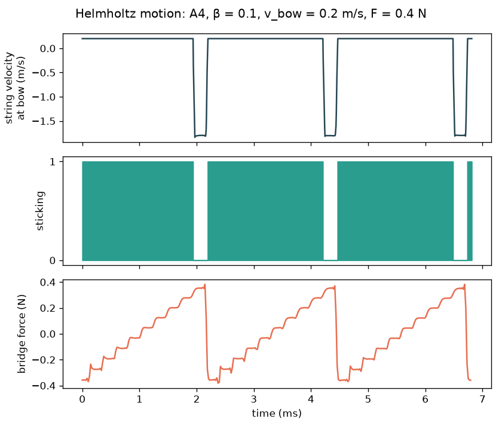
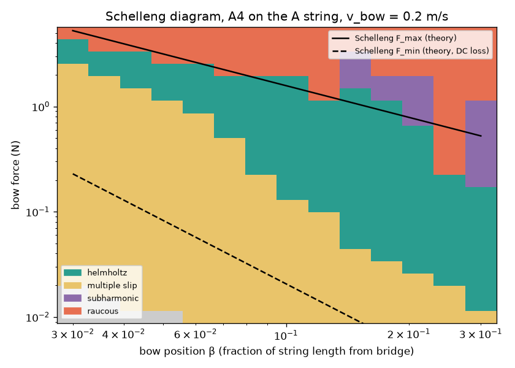
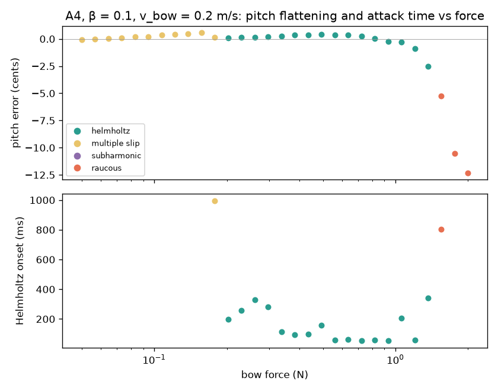
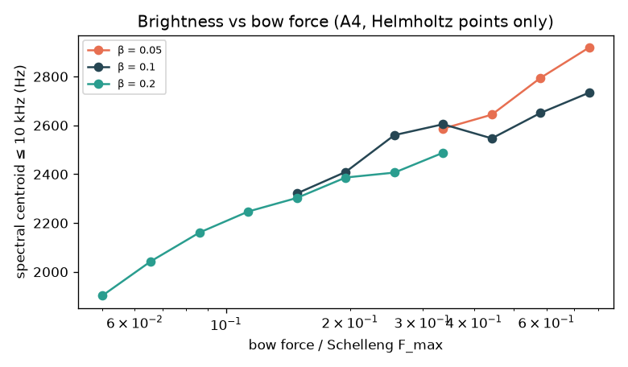
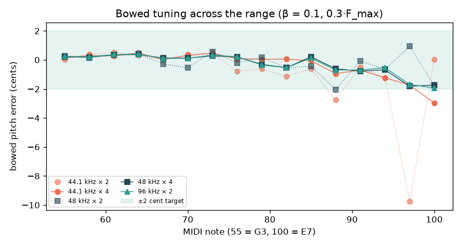
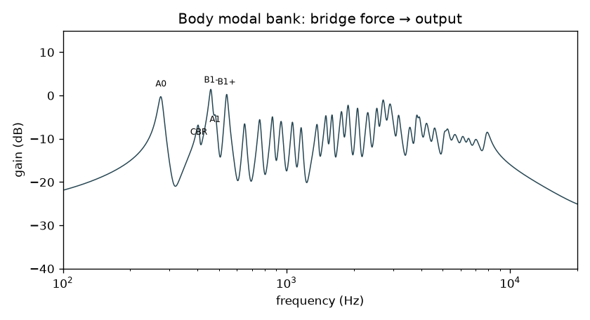

# Phase 1 Findings: Bowed-String Research Prototype

This document covers Phase 1 of the [development plan](DEVELOPMENT_PLAN.md): a Python prototype of the waveguide bowed string, friction junction and body model, built to check the physics and settle parameters before the C++ port in Phase 2.

Every number and figure here is regenerated by `research/scripts/run_phase1.py` (about 20 s). The raw data is in `research/data/phase1_results.json`. See [research/README.md](../research/README.md) for setup.

---

## Summary

The Phase 1 "done when" criteria are met:

| Criterion | Result |
|---|---|
| Stable Helmholtz motion inside the Schelleng playable range | ✅ Textbook Helmholtz motion. Its upper force limit matches Schelleng's F_max. |
| Convincing sustained bowed tone and pizzicato rendered offline | ✅ 10 reference renders in `research/renders/`. A listening check confirmed authentic bowing and good pizzicato ([§3.1](#31-listening-check)). |
| Parameter ranges documented | ✅ See [§4](#4-parameters-for-the-c-port). |

Key decisions for the C++ port that came out of this phase:

1. **Run the string at an internal rate of at least 176.4 kHz**, which is 4× oversampling at 44.1/48 kHz. At 2× the top octave drifts by up to 10 cents.
2. **Specify string losses physically**, as two T60 decay times, never as raw filter coefficients. Otherwise the string sounds different at every sample rate.
3. **Tune bowed notes with a harmonic-weighted loss-filter delay**, and plucked notes with the delay at f0.
4. **Map bow force per string.** The G string needs about 2.5× more of its F_max to speak than the A string.
5. **Make bow force follow bow speed on attacks.** F_max is proportional to speed, so full force on a slow bow gives a crunchy start ([§3.1](#31-listening-check)).
6. **Keep bow force below F_max by default.** Past it, this friction model collapses into noise instead of a pitched crunch ([§3.1](#31-listening-check)).

---

## 1. What was built

`research/violin_model/`:

| Module | Contents |
|---|---|
| `friction.py` | Hyperbolic friction curve and a closed-form junction solver with stick/slip hysteresis |
| `waveguide.py` | Two-delay-line bowed string: 3rd-order Lagrange fractional delays, a one-pole loss filter set from T60s, tuning compensation, oversampling, pluck excitation |
| `body.py` | Parallel modal bank (RBJ band-pass resonators) and the mode table |
| `strings.py` | G/D/A/E string data: tension, linear density, impedance |
| `analysis.py` | Pitch estimation, stick/slip classification, Helmholtz onset time, spectral centroid |
| `experiments.py` | Schelleng, force, brightness, tuning and per-string sweeps |
| `notes.py` | Bow envelopes, vibrato and body output, for the reference renders |

The per-sample loops are written in plain numba-compiled Python so they map one-to-one onto the planned C++ classes (`FrictionJunction`, `FractionalDelay`, `LoopFilter`, `Waveguide`).

### Model in one paragraph

Velocity waves travel in two delay lines: bow↔bridge, with a round trip of βP samples, and bow↔nut, with (1−β)P, where P = fs/f0. The nut reflects with −1. The bridge reflects through −H(z), a one-pole low-pass whose DC gain and pole are derived from the requested decay times at DC and 4 kHz. At the bow, the incoming waves sum to v_h, and the junction solves force balance against the friction curve. It sticks if |2Z(v_bow − v_h)| ≤ μs·F; otherwise it takes the slip root of a quadratic. Hysteresis keeps the previous state where both are possible. The output is the transverse bridge force, which drives the body bank.

---

## 2. Results

### 2.1 Helmholtz motion

A4, β = 0.1, v_bow = 0.2 m/s, F = 0.4 N:

- **One slip per period**, and the bow sticks for 90% of the period. Theory predicts 1 − β = 0.9.
- **Slip velocity is −1.8 m/s**, the theoretical −v_bow(1−β)/β.
- **The bridge force is a sawtooth with about 1/β = 10 small steps per period.** This is the "Helmholtz ripple" from reflections between the bow and the bridge, a known feature of real bowed strings.

### 2.2 Schelleng diagram

Sweep: 14 bow positions × 24 forces, A4, v_bow = 0.2 m/s.

- **Upper force limit:** for β = 0.03–0.21, the measured Helmholtz upper edge is 0.66–1.21 × Schelleng's F_max = 2Z·v_bow / (β(μs − μd)). That is within one or two steps of the force grid, whose points are 31% apart. At β ≥ 0.25, subharmonic and raucous motion set in well below F_max.
- **Lower force limit:** the measured lower edge scales roughly as β⁻², as Schelleng predicts. It sits about 10× above his F_min computed from the loop's DC loss. The effective bridge resistance is therefore much lower than the DC figure, because the high-frequency losses round the Helmholtz corner. This is the mechanism Schelleng's F_min describes, but with our frequency-dependent damping rather than a single resistance.
- **Other regimes:** too little force gives **multiple slipping** (surface sound). Too much gives **raucous** motion, and at β ≥ 0.15 a band of **subharmonic** motion (period doubling, related to ALF). This matches the qualitative picture in Woodhouse (2014) and Schoonderwaldt's measurements.

### 2.3 Force: pitch flattening and attack time

A4, β = 0.1, v_bow = 0.2 m/s:

- **Helmholtz range:** 0.20–1.37 N. Theory gives F_max = 1.52 N.
- **Pitch:** within ±0.5 cents across most of the range. It then flattens progressively towards the upper limit: −2.5 cents at 1.37 N, and −5 to −12 cents once motion turns raucous. This is the well-known flattening effect of heavy bowing.
- **Helmholtz onset:**
  - 50–100 ms in the middle of the range.
  - 200–350 ms near either edge.
  - Close to 1 s in the multiple-slip region near the lower edge.

  Attacks that stay near the middle of the playable range speak fastest, which gives Phase 5's articulations a clear target.

### 2.4 Brightness

Within Helmholtz motion, **brightness rises with bow force**. At β = 0.2 the spectral centroid goes from 1.9 to 2.5 kHz, and at β = 0.1 from 2.3 to 2.7 kHz. Force sharpens the Helmholtz corner.

At a fixed fraction of F_max, bow position on its own changes the centroid little. Sul ponticello sounds brighter mainly because playing near the bridge demands much higher force. The UI's "bow position" control therefore has to move force along with β, or ponticello will sound wrong.

### 2.5 Tuning

**Plucked (free) vibration** is within ±0.25 cents from G3 to E7 at 44.1, 48 and 96 kHz.

**Bowed tuning** needed three fixes, found by measuring:

1. **Physical loss specification.** The first version set the loss filter's pole directly, so its cutoff in Hz, and therefore the string's behaviour, changed with the sample rate and oversampling factor. Losses are now set from T60 at DC and at 4 kHz, and the filter is solved at each rate.
2. **Harmonic-weighted delay compensation.** Helmholtz motion is a sawtooth, and its period is set by all its harmonics together. Compensating the loss filter's phase delay at f0 alone left bowed notes consistently sharp, by about +1 cent at A4 and about +4 cents at A6. Averaging the phase delay over harmonics with the sawtooth's 1/n weights removes this. Pizzicato keeps compensation at f0, because each partial of a free vibration keeps its own pitch.
3. **Internal rate of at least 176.4 kHz.** Below that, the stick/slip transitions snap to the sample grid and pull the period towards whole samples. Worst case is C#7 at 44.1 kHz × 2, which is 9.8 cents off.

| Internal rate | Worst bowed error, G3–E7 |
|---|---|
| 44.1 kHz × 2 = 88.2 kHz | 9.8 cents (C#7) |
| 48 kHz × 2 = 96 kHz | 2.0 cents |
| 44.1 kHz × 4 = 176.4 kHz | 3.0 cents (E7 only; ≤ 1.7 up to C#7) |
| 48 kHz × 4 = 192 kHz | 1.8 cents |
| 96 kHz × 2 = 192 kHz | 1.9 cents |

Along the way, the pitch estimator was upsampled for short periods. Parabolic interpolation on an autocorrelation sampled only about 20 times per period is biased by several cents, and that bias was initially mistaken for a model error.

### 2.6 Per-string force windows

Open strings, β = 0.1, v_bow = 0.2 m/s. Force is given as a fraction of Schelleng's F_max for that string:

| String | Z (kg/s) | F_max (N) | Helmholtz from | to |
|---|---|---|---|---|
| G | 0.350 | 2.80 | 0.24 | 0.74 |
| D | 0.234 | 1.87 | 0.13 | 0.87 |
| A | 0.197 | 1.58 | 0.09 | 0.87 |
| E | 0.180 | 1.44 | 0.11 | 0.87 |

**Update:** the plugin now caps the G, D and E windows lower, where the tone is still clean after the attack (see [BOW_NOISE.md](BOW_NOISE.md)).

The lower limit scales with Z² and F_max only with Z, so the heavy G string has a narrower window that starts higher. A single force curve for all strings would make low notes scratch or fail to speak. At 0.3·F_max, G3 took 1.4 s to reach Helmholtz motion; at 0.5·F_max it took 0.1 s.

### 2.7 Body

The modal bank has:
- the named low modes (A0 275 Hz, CBR 405 Hz, B1− 460 Hz, A1 480 Hz, B1+ 540 Hz), placed within published ranges;
- 28 seeded higher modes from 850 Hz to 8 kHz, with a broad bridge hill near 2.5 kHz.

**This is a plausible placeholder, not a measured violin.** It is noticeably sparser and more peaky above 1 kHz than real bridge admittance data. Phase 3 should replace it with measured modes or an impulse response. **Update:** measured bodies from open data are now available; see [BODY_MODELLING.md](BODY_MODELLING.md).

### 2.8 Performance

The numba reference, one string at 192 kHz internal including decimation, runs at **11 ms per second of audio**, about 1% of one core. The C++ target is under 3% per voice for string plus body. The string itself should be comfortably within budget, and the body bank at the output rate is the larger cost.

---

## 3. Reference renders

In `research/renders/`: 48 kHz, 24-bit mono, normalised to −1 dBFS, and passed through the body model.

| File | What it demonstrates |
|---|---|
| `A4_mf_senza_vibrato.wav` | Plain sustained tone, Helmholtz motion |
| `A4_mf_vibrato.wav` | 5.5 Hz, 30-cent vibrato (delayed onset) |
| `G3_mf_vibrato.wav` | Low G string (0.5·F_max, see §2.6) |
| `E5_f_vibrato.wav` | Forte on the E string (faster bow) |
| `A4_p_sul_tasto.wav` | β = 0.2, slow bow |
| `A4_f_sul_ponticello.wav` | β = 0.04 at 0.7·F_max: bright, and 6 cents flat from heavy force. Speaks in 12 ms. |
| `A4_too_little_force.wav` | Multiple slipping ("surface sound") |
| `A4_too_much_force.wav` | Raucous, crushed tone |
| `A4_pizzicato.wav`, `G3_pizzicato.wav` | Velocity-pulse pluck |

### 3.1 Listening check

Heard on a phone, with the renders converted to 16-bit:

| Render | Verdict | Follow-up |
|---|---|---|
| 01–05 bowed notes | Sound like authentic bowing | — |
| 06 sul ponticello | Distortion at the start | **Fixed** (see below) |
| 07–08 pizzicato | Sound good | — |
| 09 too little force | Fine, but quiet at first and then swells | Expected |
| 10 too much force | Almost white noise | **Open model limitation** |

**06, crunchy attack (fixed).** The bow envelope applied force faster than bow speed. Because F_max = 2Z·v_bow / (β(μs−μd)) is proportional to speed, the start of the note was far above F_max. The motion stayed aperiodic, with periodicity 0.4–0.7, for the first 0.45 s. Near the bridge the playable window is narrow, so this was most audible there. Force now follows the speed envelope, keeping F at a constant fraction of F_max(v_bow(t)). Ponticello then reaches Helmholtz motion in 12 ms, and the other bowed notes in 0.16–0.20 s.

**09, slow swell (expected).** With too little force the bow can't hold the string for a full Helmholtz cycle, so energy builds up gradually through repeated partial slips.

**10, overpressure turns to noise (open).** Periodicity of the steady tone against force, as a fraction of F_max: 0.94 at 0.9, 0.81 at 1.0, 0.47 at 1.1, 0.27 at 1.2, and 0.10 at 1.6. A real violin bowed too hard crunches but keeps a recognisable pitch; this model loses it almost completely just past F_max. Until overpressure is modelled properly (see §5), the plugin should cap force a little below F_max, around 0.9, and treat "crunch" as a separate, controlled effect.

`renders/measurements.json` records each render's settings, motion label, pitch error, RMS, spectral centroid and Helmholtz onset time. **Phase 2 regression tests** should run the C++ engine with the same settings and compare against these measurements: same motion label, pitch within 0.5 cents, centroid within 5%, onset within 20 ms. Bit-exact comparison won't work because of the floating-point and implementation differences.

---

## 4. Parameters for the C++ port

| Parameter | Value / range | Notes |
|---|---|---|
| Internal string rate | ≥ 176.4 kHz | 4× at 44.1/48 kHz, 2× at 88.2/96, 1× at 176.4/192 (`recommended_oversample`) |
| Fractional delay | 3rd-order Lagrange | Needs ≥ 2 samples per segment, which sets the minimum β |
| String impedance Z | G 0.350, D 0.234, A 0.197, E 0.180 kg/s | From tension and length (`strings.py`) |
| Friction | μs = 0.8, μd = 0.3, v0 = 0.1 m/s | Hyperbolic curve |
| Losses | T60 = 1.5 s (DC), 0.25 s at 4 kHz | Recompute the filter when f0 changes (control rate) |
| Tuning compensation | Harmonic 1/n weights (bowed), f0 (pizzicato) | Crossfade when switching articulation |
| Bow position β | max(0.02, 1.2·β_min(f0)) … 0.3 | β_min = (2 + τ)/P |
| Bow velocity | 0.05 – 1.0 m/s | Main dynamics control |
| Bow force | Normalised 0–1 mapped into each string's window (§2.6) | Relative to F_max(β, v_bow, Z) |
| Bow force envelope | F = fraction · F_max(β, v_bow(t), Z) | Force follows speed through attack and release |
| Bow force ceiling | ≈ 0.9 · F_max until overpressure is modelled | Above F_max the model turns to noise (§3.1) |
| Pizzicato | 0.5 ms raised-cosine velocity pulse, T60 0.8 s / 0.15 s | Placeholder excitation |

---

## 5. Limitations and open questions

- **The body is synthetic** (§2.7). It is the biggest remaining gap in realism.
- **The pizzicato excitation is a velocity pulse**, not a true finger pluck (a released displacement). Phase 5 should revisit it.
- **Not yet modelled:** string stiffness (dispersion), torsional waves, finite bow width and bow-hair noise. Torsion in particular is known to lower the minimum bow force and to stabilise Helmholtz motion.
- **Top-octave tuning:** a residual 2–3 cents at C7–E7, even at 176 kHz.
- **The analysis thresholds** separating Helmholtz, multiple slip and raucous motion are practical choices, which affect where the diagram's boundaries fall by about one grid step.
- **Overpressure sounds like noise, not crunch** (§3.1). A real bow pressed too hard gives a gritty but still pitched sound. Likely missing ingredients: bow-hair compliance, finite bow width, torsional waves, or a friction model with thermal memory in place of the hyperbolic curve.

## References

- J. O. Smith, *Physical Audio Signal Processing*, CCRMA: bowed strings, waveguides, Lagrange interpolation.
- M. E. McIntyre, R. T. Schumacher, J. Woodhouse, "On the oscillations of musical instruments", JASA 74(5), 1983.
- J. C. Schelleng, "The bowed string and the player", JASA 53(1), 1973.
- S. Serafin, *The sound of friction*, PhD thesis, Stanford, 2004.
- J. Woodhouse, "The acoustics of the violin: a review", Rep. Prog. Phys. 77, 2014.
- G. Bissinger, "Structural acoustics of good and bad violins", JASA 124(3), 2008.
- E. Schoonderwaldt, *Mechanics and acoustics of violin bowing*, PhD thesis, KTH, 2009.
